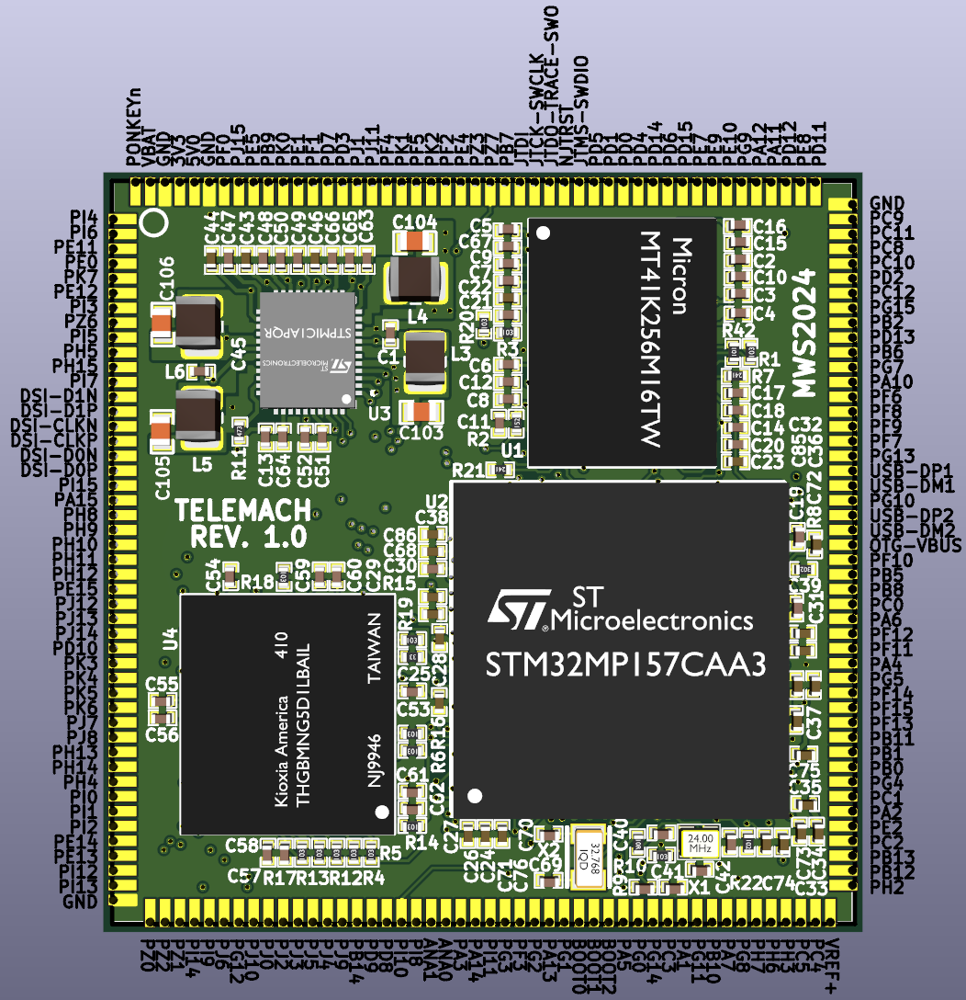

# meta-stm32mp157-som

## Introduction

meta-stm32mp157-som is a layer providing the Sofjan Stm32mp157 SOM board hardware support for Yocto-based OpenSTLinux system.

Stm32mp157 SOM - Telemach <br>
<br>

 <br>

## System image

This layer should be used in order to build the st-image-weston image. It provides changes including the QT libraries.

## Building the system image

In order to build the system image a Distribution Package provided by STMicroelectronics is required. The whole building process is described on the ST wiki pages:

https://wiki.st.com/stm32mpu/wiki/STM32MP1_Distribution_Package

The summary of required steps is shown below:

```shell
mkdir openstlinux-5.15-yocto-kirkstone-mp1-v22.11.23
cd openstlinux-5.15-yocto-kirkstone-mp1-v22.11.23
repo init -u https://github.com/STMicroelectronics/oe-manifest.git -b refs/tags/openstlinux-5.15-yocto-kirkstone-mp1-v22.11.23
repo sync
cd layers/meta-st
git clone -b kirkstone git@github.com:voloviq/meta-telemach-som.git
cd ../../
DISTRO=openstlinux-weston MACHINE=telemach-som source layers/meta-st/scripts/envsetup.sh
bitbake-layers add-layer ../layers/meta-st/meta-st-stm32mp-addons/
bitbake-layers add-layer ../layers/meta-st/meta-telemach-som/meta-semtech
bitbake-layers add-layer ../layers/meta-st/meta-telemach-som/meta-aws
bitbake st-image-weston
```
**Note:**
To save some space in disk modify two records in local.conf file <br>
DL_DIR ?= "${HOME}/openstlinux-5.15-yocto-kirkstone-mp1-v22.11.23/downloads" <br>
SSTATE_DIR ?= "${HOME}/openstlinux-5.15-yocto-kirkstone-mp1-v22.11.23/sstate-cache" <br>

**Note:**
Adding new layer can only be one time <br>
bitbake-layers add-layer ../layers/meta-st/meta-st-stm32mp-addons/ <br>

Above record save space when new compilation for new board will be performed. There will be common download and sstate-cache.

The following Sofjan Stm32mp157 Telemach SOM are available:
* telemach-som Module with SD Card

The compiled image files are located in the directory:

```
/.../openstlinux-5.15-yocto-kirkstone-mp1-v22.11.23/build-openstlinuxweston-telemach-som/tmp-glibc/deploy/images
```

## Installing SD card image

The SD card image needs to be created using the available script after the building process:

```
cd ~/openstlinux-5.15-yocto-kirkstone-mp1-v22.11.23/build-openstlinuxweston-telemach-som/tmp-glibc/deploy/images/telemach-som/scripts
./create_sdcard_from_flashlayout.sh ../flashlayout_st-image-weston/trusted/FlashLayout_telemach-som-trusted.tsv
```

The system image is located in the FlashLayout_sdcard_<MACHINE_NAME>-trusted.raw file in the tmp-glibc/deploy/images/<MACHINE_NAME> directory. To install the image to a card connected to host PC the dd command may be used:

```
sudo dd if=../flashlayout_st-image-weston/trusted/../../FlashLayout_telemach-som-trusted of=/dev/sdc bs=8M conv=fdatasync status=progress
```

To boot the system from SD card on Stm32mp157 SOM Telemach the BOOT jumpers must be set to 101.

## Building the SDK

The SDK for the host system can be build by calling the bitbake command:

```shell
bitbake st-image-weston -c populate_sdk
```

The SDK installer (st-image-weston-openstlinux-weston-<MACHINE_NAME>-x86_64-toolchain-2.6-snapshot.sh) is located in the tmp-glibc/deploy/sdk directory.
